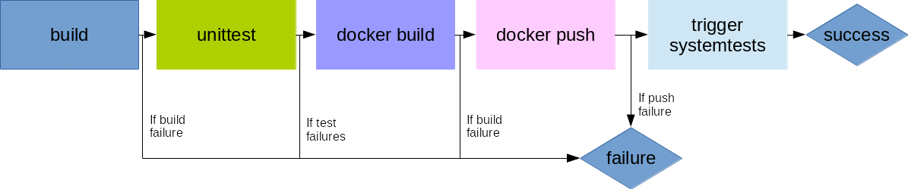

# EnMasse CI

EnMasse uses [Travis CI](http://travis-ci.org/) for continuous integration (CI). All components
in EnMasse is built, unit tested and dockerized in each individual repository. Before the docker
image is tagged with 'latest' version, a full systemtest run with the built image is performed. If
the test is successfull (and it is not a PR), the new image is marked as latest on [Docker Hub](https://hub.docker.com/r/enmasseproject/).

