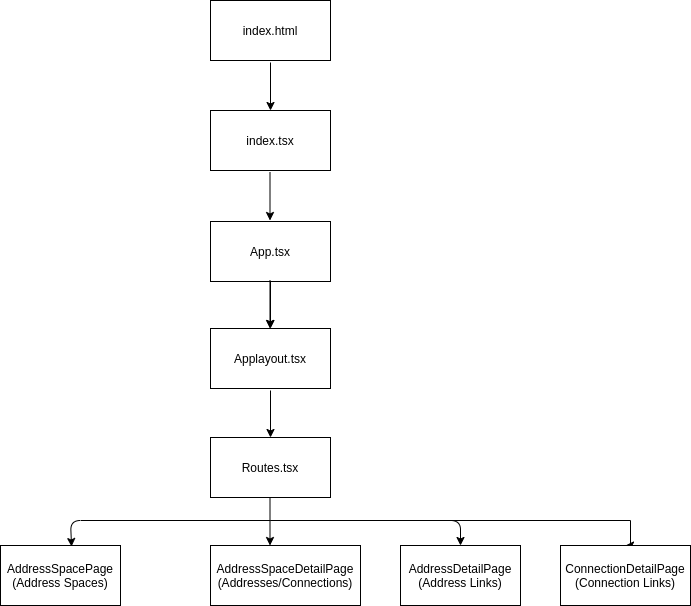

:toc:
:toclevels: 4

= Enmasse - Console UI Design

== Objective

Currently, the Console in EnMasse actually comprises two separate web-applications that are hyperlinked together. These are known as the Global Console (which allows create/read/update/delete of address spaces), and the Address Space Console which allows the addresses within an address space to be managed and the connections to the address space to be seen. In addition the Address Space Console exposed address and connection level statistics.
For this phase, the responsibilities for address management, address metrics, connection view and connection metrics will be transferred to Global Console. This will allow the Address Space Console to be retired and the agent relieved of responsibilities for serving the Address Space Console application.

== Users

Enterprises that are using container services to manage distributed systems.

== UX Designs

For UX designs, refer to the link as given below:
https://marvelapp.com/4hgeg9j/screen/62834203

== Improvement Scope

* Tooltip explanations about the console functionalities
* Find an alternative to container ids being displayed on the table
* Simplify UX to reach all the components (Address Links/Connection Links) from the home page
* Simplify UX for filters and certificates
* Add more UI tests for filters and GraphQL client data
* Differences in Mock server and Real server needs to be minimized, for faster turn-around of defects. 

== Literature Review & References

- Patternfly :
PatternFly is an open source design system created to enable consistency and usability across a wide range of applications and use cases. PatternFly provides clear standards, guidance, and tools that help designers and developers work together more efficiently and build better user experiences.
https://www.patternfly.org/v4/get-started/about

- React Testing Library:
React Testing Library helps write maintainable tests for React components. As a part of this goal, you want your tests to avoid including implementation details of your components and rather focus on making your tests give you the confidence for which they are intended. As part of this,you want your testbase to be maintainable in the long run.
https://testing-library.com/docs/react-testing-library/intro

- Apollo Client:
Apollo Client is a complete state management library for JavaScript apps. Simply write a GraphQL query, and Apollo Client will take care of requesting and caching your data, as well as updating your UI. Fetching data with Apollo Client guides you to structure your code in a predictable, declarative way consistent with modern React best practices. With Apollo, you can build high-quality features faster without the hassle of writing data plumbing boilerplate.
https://www.apollographql.com/docs/react/

- Storybook:
Storybook is an open source tool for developing UI components in isolation. It makes building stunning UIs organized and efficient.
https://storybook.js.org/

- Context:
Context provides a way to pass data through the component tree without having to pass props down manually at every level.
https://reactjs.org/docs/context.html

== Data Sources

The server is responsible for fetching data and enabling mutation (create , update , delete) for all the tables and header details. The server also enables filter, pagination and sorting. For more details and sample queries, visit the link below:
https://github.com/EnMasseProject/enmasse/tree/master/console/console-init/ui/mock-console-server

== Project Approach

=== Summary

The EnMasse console is divided into 5 major components:

* Address Space
* Address
* Connection
* Address detail with links
* Connection detail with links
        
The hierarchy of these modules is given below:

image:images/console-entity-relationship.png[]

=== Project Structure

==== public/index.html

When the application starts this is the first page that is loaded. This file has a line of code 

. This line is very significant since all the application components are loaded into this div.

==== index.tsx

This is the typescript file corresponding to index.html. HashRouter is included in this file. This is also the entry point to the application components.

==== package.json

This File has the list of node dependencies which are needed, for eg GraphQL apollo client, Patternfly, react router etc.

==== src/app.tsx

This is the file for App Component. App Component is the main component in React which acts as a container for all other components. This includes the Store Provider to create and use context, Error Boundary to handle application errors and the App Layout Component.

==== AppLayout.tsx

This file defines the layout of the page which includes the page header, toolbar , help and User info. The page is also responsible for defining the client for GraphQL, Modals and alerts.

==== Routes.tsx

This component defines all the parent routes, and its subsequent landing components.

==== components

This folder includes all the visual components that are used in multiple scenarios across the whole application. These are common visual components used in many modules in the application. For instance, pagination, type ahead.

==== constants

This includes all the constant variables used in multiple instances in the app. For eg, poll interval 
CONTEXT-STATE-REDUCER
This is responsible for managing states using Context API. Currently this is being used only for error handling.

==== graphql-module

All the queries are written here. They have been categorized based on modules like Address, Connection, AddressSpace, User etc.

==== modules

This is the most important part of the Application. This includes all the components (visual and data) across all modules and are categorized based on the Page they render like Address Space, Address, Connection, Address Detail, Connection Detail. For more details about the modules refer the next section.

==== tests

All test files are placed in this folder. The tests currently are all UI tests and have been created using React Testing Library. The intention of the tests is mainly to test the application based on the actions that a user will perform thereby avoiding the implementation details of the components.

==== utils

This folder contains all the common functions being used across the application.

=== Modules

As stated earlier, the modules are divided into 5 major components:

* Address Space
* Address
* Connection
* Address Detail
* Connection Detail

Each of these modules are actually pages in the Application. As it’s given in the designs, these pages contain Headers, Toolbars, Filters, Table, Dialogs etc. The components for these modules are subdivided based on these features. Below is a typical sub division of a module: 

==== components

These contain only the visual components of the page.

==== containers

These components are responsible for calling the GraphQL Queries, getting a response and then passing the response to the visual components.

==== utils

These components include all the common functions used across the Address Space module. For eg, formatters that add an icon to response based on the plan and type.

==== dialogs

These components are mainly modals and wizards that are displayed during any kind of mutation for Address Spaces.

==== Routes

These components contain the details of the child routes.

==== page components

This component is the entry point of any Module. This component is responsible for formulating the entire page by calling rest of the components that constitute the page.
