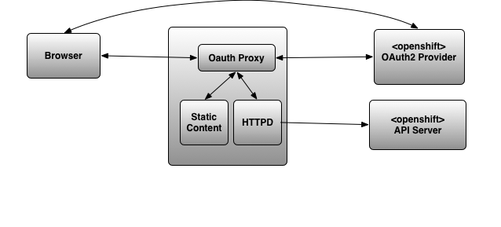

:toc:
:toclevels: 4

== Overview

The Console in EnMasse comprises two separate web-applications that are hyperlinked together.

* Global Console - that allows the viewing and management of address spaces.
* Address Space Console - that allows the viewing and management of:
 * addresses within an address space, and
 * messaging connections made by applications within that address space.
 * statistics

In the long term, the desire is that current responsibilities of the Address Space Console will be migrated into the Global Console and the separate Address Space Consoles will be retired completed.

In addition it is desired that the Global Console is extensible to manage other Custom Resources too. The use-case here is to manage the Custom Resources that correspond to other messaging infrastructure for instance Apache Strimzi. The architecture will allow the view and the control of the Custom Resource to be plugged in. This will allow the UI to present a multi-stage create workflow targeted to the Resource in question.

In the long term, the Global Console will also present key statistics about each managed resource. This will allow the user to understand a glance the state of the whole system. The statistics being presented will vary depending on the resource in question. Statistic won't be included in the first phase.

== Global Console Design

The Global Console is a Pattern Fly 4/React-JS application.  It is served by Oauth-proxy (https://github.com/openshift/oauth-proxy or https://github.com/pusher/oauth2_proxy).

Authentication is delegated to the Oauth-proxy component.

- For OpenShift, OpenShift Oauth-Proxy is configured to authenticate against the OAuth2 server of OpenShift itself.
- For Kubernetes, Pusher Oauth-Proxy is configued with Open ID Connect (OIDC).  This needs to be the same OIDC instance that Kubernetes is configured to use itself.

The UI will use the Kubernetes API to list and control the resources that it needs to expose for Management. This part of the UI will be extensible so that the ability to control other resources can be enabled. In the first the phase the two resource types exposed for management will be EnMasse's standard addressspace and brokered addressspace.

Initially the UI will periodically poll the API for the list of resources (standard address space and brokered address space). Later this will evolve to utilise watch for a more responsive UI with fewer overheads.

There is support for a multi page create workflow that will allow the user to create new instances of managed resources. The HTML and JS supporting this workflow will be implementations of a pluggable API exposed by the Console itself.

It will be possible for the user to click through from the the managed resource to the existing Console of that resource. To enable this, the resource will expose a console URL. EnMasse's Console will be improved to allow back navigation. Authentication will be seem-less as the existing OAUTH session will be valid for the old Console too.

There are no new authorisation requirements. Existing RBAC controls on managed resources will be sufficient to protect access.

The resources of the Global Console will be installed by the EnMasse Operator.

=== Detailed Design

==== Exposing the Kubernetes API server

The Global Console needs to be able to interact with the Kubernetes API server for the purpose of listing, create, updating, and deleting managed resources such as address spaces.

Out of the box, a Global Console cannot communicate directly with the Kubernetes API server owning to the default CORS restrictions.  These restrictions can be relaxed within kubernetes/Openshift deployment, but this is not an acceptable design.

The alternative is to proxy the api-server.  The proxy needs to be capable of forwarding the request, along with the OAuth/OIDC token (expressed as a Authorization header carrying a Bearer + token).

We use the proxying abilities of oauth-proxy.

===== Openshift oauth-proxy

OpenShift oauth-proxy provides a reverse proxy mechansim with the ability to inject the token obtained during the OAuth2 authentication into the proxied requests.  We can use the reverse proxy feature to proxy the Kubernetes API server.  In addition it would be tasked with serving the static content.

This approach works with one wrinkle.  Oauth-proxy supports flag `--pass-access-token=true` which instructs it to pass the access token to the proxied server (the 'upstream' its parlance), however it passes it using a custom header 'X-Forwarded-Access-Token' which is not understood by the kubernetes API server.

It is possible to workaround this problem either by using a Apache HTTPD sidecar that simply rewrites the request header (SetEnvIf/RequestHeader directives).  The HTTPD instance would be private to the pod (i.e. listen to localhost only).

Longer term, it would also be simple to enhance oauth-proxy to have the ability to pass the Authorization header through to the backend.

In this scheme, the HTML/JS application, once authenticated makes an API request to `document.location.orgin + "/api/..." without the access token.  The access token is belended into the request as it travels through the proxy/HTTPD combo.  The front end applicaton never sees the access token.

==== Operator integration

The Operator is be responsibility for the installation of the global console and the creation of the resources it needs.  Its behaviour needs to be different depending on whether Openshift or a Kubernetes platform is in use.

===== Console Service CRD

There will be a Console Service CRD.  When an instance of this CRD exists, the operator will trigger the installation of the Global Console.

On OpenShift an instance of the Console CRD will be created automatically, thus bootstraping the install of the console on that platform.  On Kubernetes, the user will create the CR by hand to install the console.

====== CRD Definition

The CRD encapsulates the following:

- discoveryMetadataURL - a URL referencing an OAuth discovery metadata https://tools.ietf.org/id/draft-ietf-oauth-discovery-08.html.  Discovery metadata is becoming increasing common, but we'd allow the url to be a data-url so a user could construct their own discover document if need be.
- certificateSecret a reference to TLS certifcate secret
- oauthClientSecret - a secret containing the OAuth client-id and client secret
- ssoCookieSecret - a secret used to crypt the cookie laid by OAuth-Proxy on the browser.  This cookie contains the OAuth/OIDC token.
- ssoCookieDomain - if set, the domain of the cookie laid by OAuth-Proxy
- scope - OAuth scpe
- host - hostname used by the Global Console.

===== Resources controlled by the Operator

The Operator uses the information in the Console Service CR to create and keep synchronised the following resources.

- service (with serving-cert-secret-name on OpenShift).
- deployment (with containers for oauth-proxy and the HTTD sidecar)
- secrets
 - oauthClientSecret
 - ssoCookieDomain
 - certificateSecret
- oauthclient (OpenShift only - kept in synch with the oauthClientSecret client-id/secret)
- route (OpenShift only)

On OpenShift, when an address space is added or removed, the operator updates the OAuthClient redircect uris with the route of the new Address Space Console.

== Global Console Diagram

== Address Space Console Changes

=== Authentication

The Address Space Console uses OAuth or OIDC for authentication.

It is a responsibility of the Address Space Controller to configure the Agent with the OAuth/OIDC settings from the Console Service CR.

In addition, the Address Space Console is capable of reading the SSO cookie laid by OAuth-Proxy.  If the Address Space Console finds this HTTP Cookie, and will use the content of the cookie rather than prompting the user to login again.  This gives an signle sign-on experience between the two consoles.

=== Authorisation

The Address Space Console uses Kubernetes RBAC to make authorisation decisions.

It uses `selfsubjectaccessreviews` to work out the permissions of the user.

- if the user has address `list` permission in the address space's namespace, the user is permitted access to the Address Space Console.
- if the user had address `create` or `delete` permissions in the address space's namespace, the buttons to create and delete addresses are enabled.

The user's actions are performed with the user's access token.  If the user's action fails with a permisison or other type of error, that is reported by the workflow.

=== Navigation back from Address Space Console to the Global Console.

If the Global Console is available, there is a back link that take the user from the Address Space Console to the Global Console.

