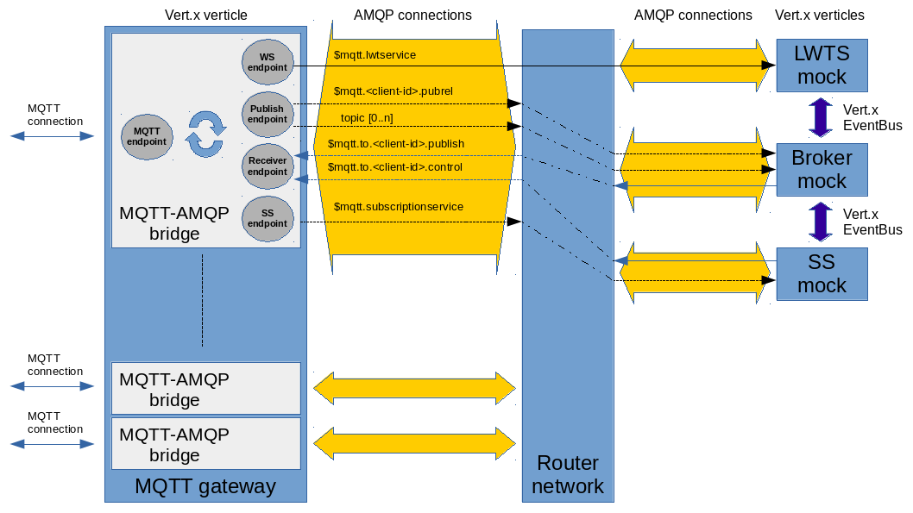

[[mqtt-over-amqp]]
= MQTT over AMQP

Design and specification for bringing MQTT features over AMQP protocol.

_______________________________________________________________________________________________________________________________________________________________________________________________________________________________________________________________
The main purpose of this specification isn't the simple bridge from MQTT
to AMQP but adding native MQTT features on top of AMQP. It means, for
example, having "will", "retained" messages and client sessions on AMQP
so that a pure AMQP client can use them.
_______________________________________________________________________________________________________________________________________________________________________________________________________________________________________________________________

[[preface]]
== Preface

The following documentation has no assumptions on the implementation
side. It means that every “service” can implement its API in different
ways (i.e. using AMQP brokers, database, log file, …). By the way for
each service a possible implementation is described using AMQP brokers
where "store-and-forward" is needed.

[[content]]
== Content

* link:docs/components.adoc[Components]
* Services
** link:docs/services_lwt_service.adoc[Last Will and Testament Service]
** link:docs/services_subscription_service.adoc[Subscription Services]
* Operations
** link:docs/operations_connection.adoc[Connection]
** link:docs/operations_disconnection.adoc[Disconnection]
** link:docs/operations_subscription_unsubscription.adoc[Subscription/Unsubscription]
** link:docs/operations_publish.adoc[Publish]
** link:docs/operations_keepalive.adoc[Keep alive]
* Implementation
** link:docs/implementation_lwt_service.adoc[Last Will and Testament
Service]
** link:docs/implementation_subscription_service.adoc[Subscription Service]

[[enmasse-implementation]]
== EnMasse implementation

The implementation for EnMasse can be found
https://github.com/EnMasseProject/mqtt-gateway[here] and following its
overall big picture :

