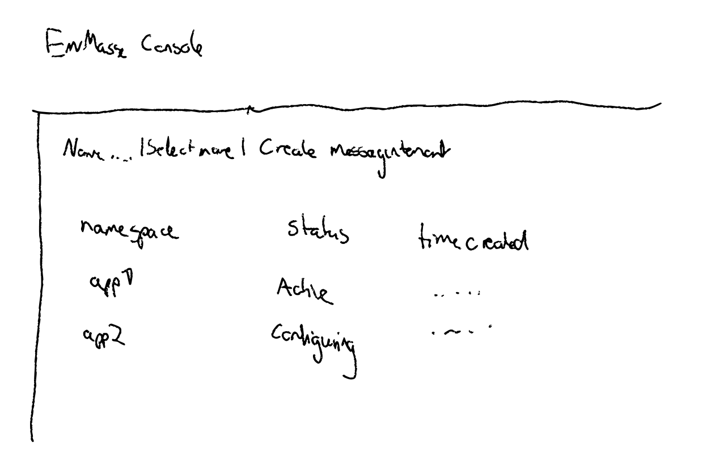
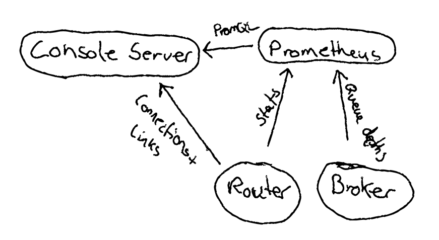

:toc:
:toclevels: 3

# Proposal - Console changes to adopt to 1.0

:toc-placement!:
toc::[]

=== Scope of this document

* Console changes related to 1.0 shared infrastructure - IoT is covered separately
* Features available in 1.0
* Features not available in 1.0
* Changes required to console APIs for 1.0
* Changes required to console backend for 1.0
* Changes required to console UIs for 1.0

The changes in document are subject to ... change! There are several types related to authentication and authorization that are not yet implemented. The design for these will come at a later stage.

=== Features

For 1.0, the set of EnMasse resources that the user must be able to maintain from the UI is:

* MessagingTenant
* MessagingAddress
* MessagingEndpoint
* IoTProject

Given the timelines, authentication and authorization-related resources, as well as the service admin console is not in scope for 1.0

=== Console API/UI changes

==== AddressSpace => MessagingTenant

* `AddressSpace` is removed and replaced by `MessagingTenant`, and there can now only be a single MessagingTenant named 'default' per Kubernetes namespace. Most of the properties like plan and authentication service (now identity provider) is now optional, and the minimum information needed to create a tenant is its namespace. In addition, a tenant may have a set of capabilities such as 'transactional'.

* Remove customizing endpoints as part of creating `AddressSpace`/`MessagingTenant` (enmasse-operator may create default endpoint specified in a `MessagingPlan`). In 1.0, one or more endpoints may be created independently of the tenant.

==== MessagingEndpoint

A new workflow for creating `MessagingEndpoints` resources is needed. This workflow should allow creating endpoints of new types that are supported in 1.0. Supported types are 'cluster', 'route', 'loadBalancer', 'ingress' and 'nodePort'.

==== MessagingAddress

Requires renaming elements from what we already have from 1.x. Address -> MessagingAddress (though UI can still display Address). In addition, each type of address have a set of additional configuration that should be possible to specify in the UI. There is also a new address type 'deadLetter' supported.

The properties that should be possible to set are (will probably be extended):

* Queues: expiryAddress, deadLetterAddress, partitions, messageTtl min+max, maxConsumers
* Topics: ...
* Subscription: topic, maxConsumers, deadLetterAddress, expiryAddress
* Anycast: ...
* Multicast: ...
* DeadLetter: ...

=== Backend changes

==== Architecture 

The arrows indicate the flow of data.

==== Metrics

At the moment console-server queries connections/links from the address space agents.

For 1.0, the agent disappears, so information must be gathered differently:

* Deploy an EnMasse-owned ephemeral Prometheus instance as planned in the initial console proposal.
* Configure prometheus to scrape router and broker pods
* Console-server querying the routers directly to build the list of connections and their links
* Console server querying the prometheus instance for address and connection metrics
* Console-server eventually also becomes backend for the CLI.
* Expose GraphQL API (with auth) to be used from systemtests
* Future: use metrics from prometheus to drive router/broker scaling
* Future: use prometheus to drive IoT/Hono scaling and request throttling

==== Management commands

Design tracked in https://github.com/EnMasseProject/enmasse/pull/4545 .
For 1.0 the supported management tasks will be close connection and purge queue. The console-backend will invoke management commands using the API described in the PR.

== Tasks

* Update mock server with new types and schema, will allow UI work to start
* Modify backend to expose new API
* Update console UI to use new API
* Deploy ephemeral prometheus when console is deployed. Unless its too much effort, make it optional, which would prevent some stats being displayed by the console, but allow installing with a lower footprint.
* Modify console backend to retrieve connections and links directly from routers
* Modify console backend to retrieve router statistics and broker metrics from prometheus
* Modify console backend to trigger management commands.

== Testing

* Verify that users can CRUDL tenants through UI
* Verify that users can CRUDL endpoints through UI
* Verify that users can CRUDL addresses through UI
* Verify that console metrics are reported in UI
* Verify that prometheus failure allows the console UI to keep functioning (but with error notification?)
* Verify that router/broker infrastructure failure allows the console UI to keep functioning (but with error notification?)

== Documentation

* Console documentation images will need to be re-taken
* Description of AddressSpaces etc. will need to be renamed