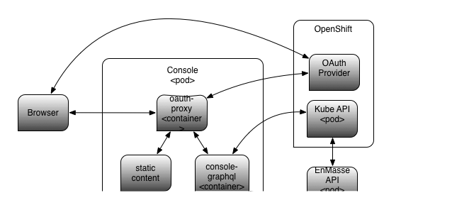

:toc:
:toclevels: 4

== Global Console Phase 2.

=== Introduction

Currently, the Console in EnMasse actually comprises two separate web-applications that are hyperlinked together.  These are
known as the Global Console (which allows create/read/update/delete of address spaces), and the Address Space Console
which allows the addresses within an address space to be managed and the connections to the address space to be seen.
In addition the Address Space Console exposed address and connection level statistics.

For this phase, the reposibilities of for address management, address metrics, connection view and connection metrics
will be transfered to Global Console.  This will allow the Address Space Console to be retired and the agent relieved of
responsibilities for serving the Address Space Console application.

The deployment of the Console will be controlled by the consoleservice CR.  This work will make it possible for EnMasse
to be used without the Console, if desired.

== High Level

There will be a new *console-graphql* component.  This will be deployed to the console pod and will be fronted by oauth-proxy.
The console-httpd sidecar will be retired.

The *console-graphql* component will present GraphQL API allowing the view/maintainence of address spaces, addresss,
and connections by the UI.  The model presented object model presented by the EnMasse GraphQL schema will be a composite
one that provides access to the resource and its metrics through a single query interface.  Mutations will permit the
create/patch/delete of address spaces and addresses, the closure of connections and purge of addresses.

The console-graphql internally will build a *cache* of address-spaces, addresses and connections, links and metrics. 

* address-spaces and addresses will be read from the Kubernetes API (utilising watches of the resources).
* connection and link information will be gathered from the agents of addressspaces themselves.
* metrics will also be scraped *directly* from the agents. 

For read operations, console-graphql will use a service acccount with *list* permission for address spaces and addresses
in order to build a global view.  It will be a responsibility of component to filter the user's view so that he can see 
only those objects to which he has permission.  It will use SelfSubjectAccessReview in order to do this.  The
SelfSubjectAccessReview responses will be cached for a short time, to save load on the server.

For write operations, console-graphql will propagate the user's bearer token made available by oauth-proxy.

Authentication will remain unchanged i.e. oauth-proxy retains the responsibility.

Note: A previous interation of this design proposed a EnMasse-owned prometheus instance.  This is removed from this version of the design in order to reduce the scope.  If we were to introduce a EnMasse-owned prometheus later, this would simple mean that console-graphql pull metrics from it, rather directly from the Agents.


=== High Level Diagram



== Components

=== console-graphql

Console-graphql will replace the HTTP sidecar.  

It will have the following responsibilities:

* present a GraphQL interface
** for queries - exposing address-spaces, addresses, connection together will link and metric information.
** for mutations - allow creation/patch/delete of address-space/address, connection close, address purge.
* populate cache with
** address-space and address (from Kubernetes API)
** connections and links (from the addressspaces' agents)
** metrics (from the addressspaces' agents)

==== GraphQL queries

The GraphQL interface will provide paginated result sets where necessary.  It will following the offset
pagination pattern https://graphql.org/learn/pagination/ rather than the cursor one.  The cursor one doesn't meet
the requirements of the UI.

There will be the following root queries:

```
namespaces()                                                         # all user-visible namespaces
whoami()                                                             # logged on user's name
addressSpacePlans()                                                  # all defined addressSpacePlans
addressPlans()                                                       # all defined addressPlans
addressSpaces(first: Int, offset: Int, filter: String, sort: String) # all user-visible addressspaces across all viewable namesspaces, paginated
addressSpace(namespace: String!, name: String!)                     # the specified addressspace
```

Paginated queries accept optional `first` and `offset` arguments.  first allows the user to request the first n items,
and defaults to infinity.  `offset` allows the user to specify a starting index and defaults to zero.  The paginated
results return a `*QueryResult` object.  This gives access to a `Total` (number of results) and a list of result objects
themselves.

Paginated queries also accept optional `filter` and sort `options`.  `sort` will be expressed as a list of JSON Path/direction pairs, specifying the sort order across multiple fields.  Numerics will be sorted as such.

* `[".spec.plan", 'up', ".spec.plan", 'down']`

`filter` will be expressed as a boolean expression with its operands supporting a JSON Path.  The capabilities of the implementation will be sufficient to meet the UI's requirements.

* `.spec.plan == "standard-small-queue"`

There will be non-root queries permitting traversal from addressspace into connections and address, both their links.

The queries will observe the cache, but will need to exclude from the results items that the user has no permission to see.

==== GraphQL mutations

There will be mutations permitting the create/delete/patch of addressspaces and addresses.  There will be mutation
allowing a address to be purged and a connection closed.

Mutations will interact directly the API backends (Kubernetes for addressspaces and addresses and the Agent API for purge
and connection closed).  It will perform this interaction using the user's bearer token.

==== Cache

The console-graphql will maintain a cache of namespace/addressspapce/address/connection, link and metric information.

It will use Kubernetes watches to build cache of namespaces/addressspapce/address.   Depending on relative timing of work for 0.31, this may need to watch the underlying configmaps.

It will poll the agents REST API for connection/link and address/link information.  If timescale allow, this API will be watchable too.  

For metrics, it will poll the Prometheus endpoints of the agents.

In all of these API interations, the bearer of the service account will be passed to the peer.

In order to locate the agent endpoint, the console-server will populate a lookup map. It will do this by watching for agent services.  When an agent service appears, it will resolve its addressspace using the `infraUuid`.

==== Metrics

The *gauge* metrics (e.g. queue depth) need no further processing.

Where the console UI requires a *rate* metric it will be console-graphql responsbility to calulate this rate from counter
metrics exposed by the agents.   It should do this calculation as Prometheus would, guarding the possibility that counter
metrics may reset to zero.

Some guage metrics required by the UI may be synthesized from the cache.  Examples of this are `enmasse_addresses` (the number of addresses currently defined in an addressspace)

=== agent

The Address Space Console and the server side support for the AMQP management interface is removed.

Agent acquires a responsibility for:

* exposing connection/link information (GET)
* exposing address/link information (GET)
* address purge operation (DELETE)
* connection close operation (DELETE)

This endpoint will require authentication (bearer token).  For the authorisation check, it will perform a self subject review for a GET on the addresspace (connection/address/link information and connection close), and on the address for purge. At a later point this will need finer RBAC controls.  (Aside: perhaps subresources help us `address/purge`?? https://kubernetes.io/docs/reference/access-authn-authz/rbac/#referring-to-resources).

The Agent will be changed to expose the additional metrics listed in the next section.  The existing metrics produced by 
agent will be maintained.   The additional metrics will be produced if optional scrape arguments specifying a white/blacklist patterns of the metrics to be produced.  If the scrape arguments are omitted today's current behaviour will be maintain.  This avoids changes to the existing Prometheus based monitoring arrangements).

=== global console

The global console will consume the GraphQL API rather than Kubernetes API is does today. This will require the
refactoring of the current addressspace view.  The patten establised by the addressspace view will then be repeated for
addresses and connections views.

The global console will need to periodically poll in order to refresh the display.  To do this, it simple repeats the
same query used to form current view.

The console must torrerate to a metric it expects being absent from the result set.

== Metrics

=== AddressSpaces

* enmasse_connections(labels:<namespace>,<addressspace>) (guage, number of connections currently made)
* enmasse_messages_in_total(labels:<namespace>,<addressspace>)  (monotonically increasing cumulative metric)
* enmasse_messages_in_total(labels:<namespace>,<addressspace>) (monotonically increasing cumulative metric)

=== Addresses

* enmasse_messages_in_total(labels:<namespace>,<addressspace>,<address>)  (monotonically increasing cumulative metric)
* enmasse_messages_out_total(labels:<namespace>,<addressspace>,<address>)  (monotonically increasing cumulative metric)
* enmasse_messages_stored(labels:<namespace>,<addressspace>,<address>) (guage)
* enmasse_shards(labels:<namespace>,<addressspace>,<address>) (instantaneous value)  Do we really want this?

=== AddressDetails

* enmasse_messages_in_total(labels:<namespace>,<addressspace>,<address>,<containerid>,<linkid>)  (monotonically increasing cumulative metric)
* enmasse_messages_out_total(labels:<namespace>,<addressspace>,<address>,<containerid>,<linkid>)  (monotonically increasing cumulative metric)
* enmasse_backlog(labels:<namespace>,<addressspace>,<address>,<containerid>,<linkid>)  (instantaneous value)

=== Connection

* enmasse_messages_in_total(labels:<namespace>,<addressspace>,<remote hostport>,<remote containerid>)  (monotonically increasing cumulative metric)
* enmasse_messages_out_total(labels:<namespace>,<addressspace>,<remote hostport>,<remote containerid>)  (monotonically increasing cumulative metric)

=== ConnectionDetails

(captures each sender/receiver attached of the connection,capturing role, link name, address)

foreach l in Deliveries, Rejected,Released, Modified,Presettled,Undelivered

* enmasse_link_stat(labels:<namespace>,<addressspace>,<remote hostport>,<remote containerid>,<linkid>,<address>,l) (instantaneous value)

= Notes

https://www.robustperception.io/using-sample_limit-to-avoid-overload
https://promcon.io/2017-munich/slides/best-practices-and-beastly-pitfalls.pdf

"Unbounded label values will blow up Prometheus"
https://prometheus.io/docs/practices/naming/
https://stackoverflow.com/questions/46373442/how-dangerous-are-high-cardinality-labels-in-prometheus
https://prometheus.io/docs/practices/instrumentation/#do-not-overuse-labels
https://github.com/prometheus/prometheus/issues/3200

https://www.robustperception.io/configuring-prometheus-storage-retention

Pagination “Relay Cursor Connections Specification.” (borrows terms from Graph Theory)

https://blog.apollographql.com/explaining-graphql-connections-c48b7c3d6976


