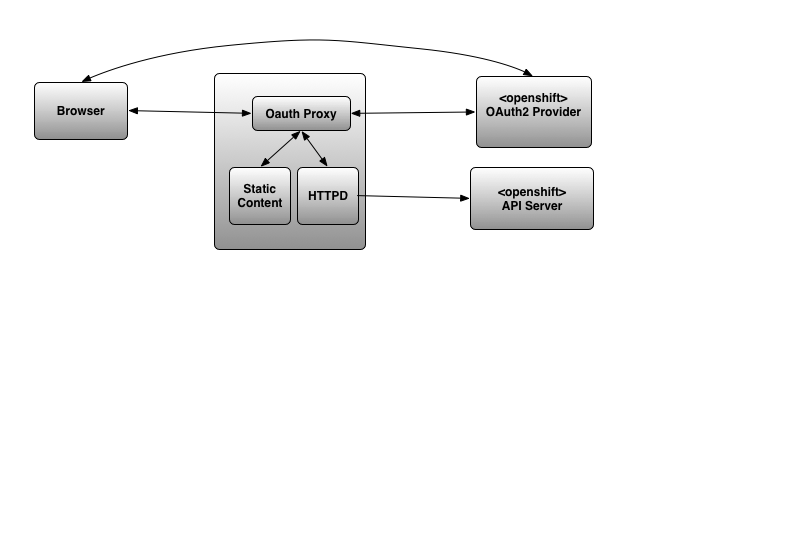

:toc:
:toclevels: 4

== Overview

Currently in EnMasse a management console is co-deployed with each addresspace. This gives the user the ability to manage the contents of the addressspace, but there is no UI that gives the user a view of the whole system nor the ability to add or delete addressspaces. This is a gap.

We desire a Global Console that has the ability to view all addressspace that exist cluster wide, gives the ability to create new addressspaces, as well as update and delete existing ones. In the longer term, it is envisaged that this new console will incorporate the address managing capabilities provided by the existing Console (and other features), but the first phase the global console will simple link to the existing consoles provided by the addressspace.

In addition it is desired that the Global Console is extensible to manage other Custom Resources too. The use-case here is to manage the Custom Resources that correspond to other messaging infrastructure for instance Apache Strimzi. Th architecture will allow the view and the control of the Custom Resource to be plugged in. This will allow the UI to present a multi-stage create workflow targeted to the Resource in question.

In the long term, the Global Console will also present key statistics about each managed resource. This will allow the user to understand a glance the state of the whole system. The statistics being presented will vary depending on the resource in question. Statistic won't be included in the first phase.

== Design

There will be a Global Console UI served from a new Global Console Server component serving the static content.

Authentication will be delegated to OAuth2. In OpenShift this will be automatically configured at deployment to use the built OAuth infrastructure. On kubernetes, the user will need to integrate their kubernetes with a OAUTH provider.

The UI will use the kubernetes API to list and control the resources that it needs to expose for Management. This part of the UI will be extensible so that the ability to control other resources can be enabled. In the first the phase the two resource types exposed for management will be EnMasse's standard addressspace and brokered addressspace. The UI will send the Bearer token in order that the server side may authorise the requests.

Initially the UI will periodically poll the API for the list of resources (standard addressspace and brokered addressspace). Later this will evolve to utilise watch for a more responsive UI with fewer overheads.

There will be support for a multi page create workflow that will allow the user to create new instances of managed resources. The HTML and JS supporting this workflow will be implementations of a pluggable API exposed by the Console itself.

It will be possible for the user to click through from the the managed resource to the existing Console of that resource. To enable this, the resource will expose a console URL. EnMasse's Console will be improved to allow back navigation. Authentication will be seem-less as the existing OAUTH session will be valid for the old Console too.

The mast head of the application will present a summary of the number of resources of each type current visible to the user, cluster-wide. In the first version, it will present only the number of brokered and standard addressspaces, separately.

There are no new authorisation requirements. Existing RBAC controls on managed resources will be sufficient to protect access.

The Global Console will use PatternFly 4. The Global Console Server will be implemented in Go. This will be responsible for serving the static content and a API endpoint returning the URLs for OAUTH redirect and the kubernetes API endpoint.

The Global Console will be installed by the EnMasse Operator.

=== Detailed Design

==== OAuth2 intergraton

There are two possibilities:

- Fully client side - implict grant type
- Server side - authorization grant tyope

===== OAuth2 implict grant type for Single Page Apps (SPAs) 

Where an application has no server side component but still requires authenication, RFC 6749 section 1.3.2 recommends the OAuth2 implict grant type. This is the workflow where the response from the authorisation endpoint returns an access token rather than authorisation code. This eliminates the authorization grant step to the sever to exchange the authorisation code for an access token.  This extra step requires knowledge of a secret which a SPA (a public app) cannot hold securely.

In the implict workflow, the SPA learns of the access token via the URL fragment received from the authorization serevr.  The SPA app needs to take steps to the ensure that the access token is not inadvertently leaked either via the browser url bar, browser history or page referer information.   I read there are also some complications in keeping the access token alive (OAuth2 refresh mechanism is disallowed for the implict workflow). There are tricks using hidden iframes but all this adds complexity of the solution.  There is some useful background: https://developer.okta.com/blog/2018/05/24/what-is-the-oauth2-implicit-grant-type. 

Finally, there is a new best practice recommendation in the form of a [Draft RFC](url
https://tools.ietf.org/html/draft-ietf-oauth-security-topics-11) that recommends a different approach leveraging on PKCE for client type public. (nice explainer: https://developer.okta.com/authentication-guide/auth-overview/#authorization-code-with-pkce-flow).   If we were to decide use the implict flow, we will want to revisit as when this RFC matures.

If we take the implict flow approach, we will need the server side to provides an unauthenticated endpoint that exposes the OAuth2 endpoint and client secret, scopes etc so the SPA may configure itself.

===== OAuth2 authorization grant type

If our design for the Global Console includes a server side component, its communications with the authorization server are confidential, so we can utilise the OAuth2 authorization grant type workflow, relieving the front end from responsobility for the access token.  Instead, the front end will hold a validated session cookie issued by the server once authentication is complete.

One out of the box option is to employ https://github.com/openshift/oauth-proxy. It provides:

"A reverse proxy and static file server that provides authentication and authorization to an OpenShift OAuth server or Kubernetes master supporting the 1.6+ remote authorization endpoints to validate access to content."

If we took this option, all the OAuth2 responsibilties would be delegated to it.  It provides the ability to customise the authentication pages and provides a sign-out endpoint.   It also takes care of serving the content of the app and we can use its proxying ability to reach the API server (more later).

===== Recommendation

Let's use oauth-proxy.  With the implict workflow, thee could be difficulties guarding the access token especially where there are touch points with ReactJS which is unfamilar to us.  There's less code to write too.

==== Exposing the kubernetes API server

The HTML/JS applications need to be able to interact with the kubernetes API server for the purpose of listing, create, updating, and deleting managed resources such as addressspaces.

Out of the box, a HTML/JS application cannot communicate with the Kubernetes API server ownin to the default CORS restrictions.  These restrictions can be relaxed within kubernetes/Openshift deployment, but this is not an acceptable design.

The alternative is to proxy the api-server.  The proxy needs to be capable of forwarding the request, along with the OAuth access token (expressed as a Authorization header carrying a Bearer + token).

I've looked at two ways of achieving the proxy.

===== Apache HTTPD

We can employ mod_proxy and mod_ssl together to form a secure tunnel through to the kubernetes API server.  In this scheme,  the application's content would be served by HTTPD.  In addition, HTTPD would be configured to expose location `/api` as a proxy for the kubernetes API server. 

When the HTML/JS application needs to interact with the kubernetes API server it would generate a request to `document.location.orgin + "/api/...".  For this scheme to work, the HTML/JS would need to be in possesion of the access token.  This implies that we've taken the OAuth2 implict grant option.

===== Openshift oauth-proxy

Openshift oauth-proxy provides a reverse proxy mechansim with the ability to inject the token obtained during the OAuth2 authentication into the proxied requests.  We can use the reverse proxy feature to proxy the kubernetes API server.  In addition it would be tasked with serving the static content.

This approach works with one wrinkle.  Oauth-proxy supports flag `--pass-access-token=true` which instructs it to pass the access token to the proxied server (the 'upstream' its parlance), however it passes it using a custom header 'X-Forwarded-Access-Token' which is not understood by the kubernetes API server.

It is possible to workaround this problem either by using a Apache HTTPD sidecar that simply rewrites the request header (SetEnvIf/RequestHeader directives).  The HTTPD instance would be private to the pod (i.e. listen to localhost only).

Longer term, it would also be simple to enhance oauth-proxy to have the ability to pass the Authorization header through to the backend.

In this scheme, the HTML/JS application, once authenticated makes an API request to `document.location.orgin + "/api/..." without the access token.  The access token is belended into the request as it travels through the proxy/HTTPD combo.  The front end applicaton never sees the access token.

===== Nginx

I took a brief look at Nginx, it looked like a solution similar to 1. (the Apache HTTPD proxy) could be achieved.  I didn't see anyay to push OAuth responsibilties the the server side (without hosting our own code).

===== Recommendation

I'm still thinking oauth-proxy.   I'd need to contant the Oauth-proxy team let them know of the use, and sound out the possiblity of an enhancement in future.  I would like the HTTPD sidecar to be as short term as possible).

==== Operator integration

The operator will be responsibilty for the installation of the global console and the creation of the resources it needs.  Its behaviour needs to be different depending on whether Openshift or a kubernetes platform is in use.

===== Console CRD

There will be a Console CRD.  When an instance of this CRD exists, the operator will trigger the installation of the global console.   It is antipicated that a cluster will have at most one instance of the console deployed.  What should happen if a second instance of the CRD is created? (Probably just log a warning and ignore it).

On Openshift an instance of the Console CRD will be created automatically, thus bootstraping the install of the console on that platform.  On kubernetes, the user will create the CR by hand to install the console.

If the CRe is removed, the Console will be undeployed by the operator.  On Openshift it won't be recreated automatically (might need state.  where would we keep it??).

====== CRD Definition

The CRD will encapsulate the following:

- oauthDiscoverURL - a URL referencing an OAuth discovery metadat https://tools.ietf.org/id/draft-ietf-oauth-discovery-08.html.  Discovery metadata is becoming increasing common, but we'd allow the url to be a data-url so a user could construct their own discover document if need be.
- oauthSecretRef - a path referencing either kubernetes secret instance or OpenShift openauthclient instance
- scope - oauth scope

On OpenShift `oauthDiscoverURL` would be optional.  The platform default https://openshift.default.svc/.well-known/oauth-authorization-server  would be used if not specified (see https://docs.openshift.com/container-platform/3.11/architecture/additional_concepts/authentication.html#oauth-server-metadata).  On kubernetes it would be mandatory.

On OpenShift `oauthSecretRef` will reference an oauthclient object (cluster wide).  On kubernetes, it will reference a namespaced secret.  The operator will use this reference to retrieve the OAuth2 client id and client secret.

===== Resources controlled by the Operator

The Operator will use the information in the Console CR to create and keep synchronised the following resources.

- oauthclient (OpenShift)
- route (OpenShift only)
- service (with serving-cert-secret-name on OpenShift).
- serviceaccount
- configmap instance 
- deployment 

On OpenShift, for the oauthclient, if the `oauthSecretRef` references an oauthclient instance that does not exist, the operator will create it. If it already exists, it will simply use it.  The Operator will ensure that the oauthclient's redirect urls are synchronized with the routes that exist to the service at that moment.  Note that we require a fully fledged oauthclient rather than https://docs.openshift.com/container-platform/3.11/architecture/additional_concepts/authentication.html#service-accounts-as-oauth-clients[utilizing an service account as oauthclient]. This is becasuse the service account form restricts the the authorized user to operations within the service account's own namespace. 

On kubernetes, the user must create the secret instance and reference it from `oauthSecretRef`.  If this is not done, the Operator will have no effect.

In both case, the Operator will push the clientid/clientsecret information to a configmap instance.  The deployment will mount the configmap as a volume allowing it to populate environment variables which can be passed to the server component(oauth-proxy).

(Note when a new address space is created and its addressspace specific console is created, the operator will need to update the oauthclient to add the console's route into the redirect-urls.  This will allow the Global Console and Addressspace Console to share the same SSO session).

== Diagram

== Testing

New Global Console tests will need to be added.

== Documentation

From the persepctive of the user, the console experience should be seemless, so the user shouldn't be aware that they are actually jumping from the global console into addressspace consoles and back again.   So the documentation covering the orientation of the user within the console just needs to be refactor to include the addressspace list navigation, create workflow and delete).

The authorisation model behind the console is now openshift based.  Docs will need to be updated here too.

