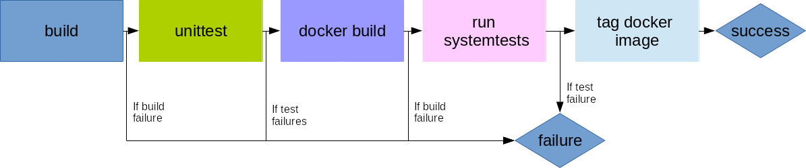

[[enmasse-ci]]
EnMasse CI
----------

EnMasse uses http://travis-ci.org/[Travis CI] for continuous integration
(CI). EnMasse is contained in a
https://github.com/EnMasseProject/enmasse[single repository] which is
build using make and maven.

Docker images are tagged with the commit hash of the build and pushed to
https://hub.docker.com/r/enmasseproject/[docker hub], and the latest
successful snapshot of the EnMasse configuration is published on
https://dl.bintray.com/enmasse/snapshots/latest/enmasse-latest.tgz[bintray].

