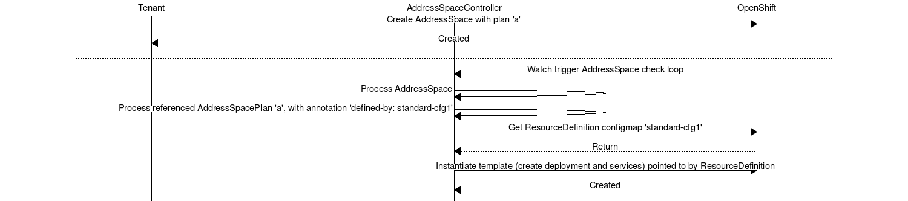
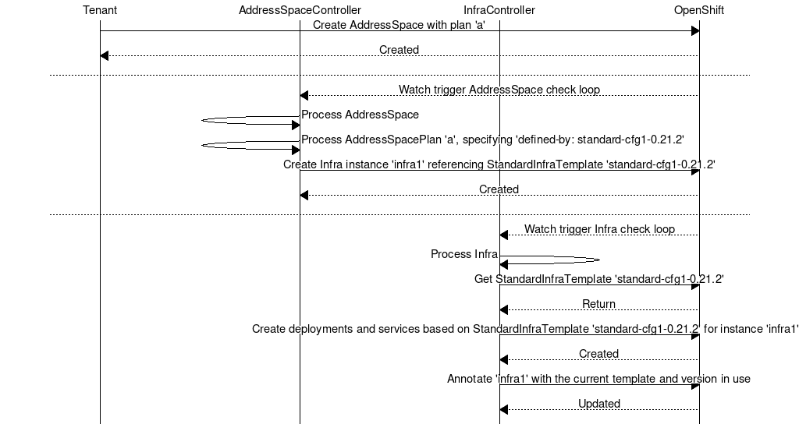
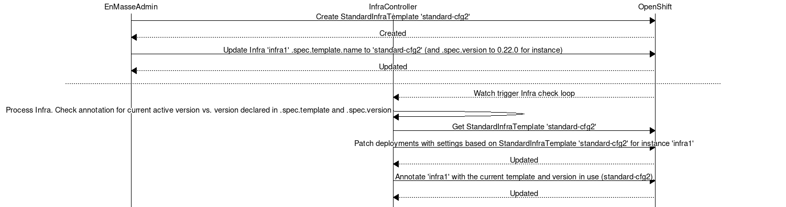

== why

Changing configuration for the standard or brokered address space today involves changing a
`resource definition` configmap, which in turn references templates (no schema validation and
checking of values for instance). 

The underlying openshift templates which are stored in a configmap
as key-value pairs and can only be changed _before_ deploying an address space or it will have to be
recreated, unless you happen to know exactly what component to change.

The settings that can be tuned and will have an effect when changed is not clear to spot, and
are scattered around in the template.

There is at present no mechanism for the service admin to upgrade the infrastructure
between different versions of EnMasse and even for changing configuration run-time and make sure the
appropriate components are changed.

The following sequence diagram illustrates what the process is today:



== what/how

This proposal attempts to address these issues by:

* Defining a resource for infrastructure configuration that clearly states the configuration settings that can be changed.
* Permit multiple configurations and versions of configurations to exist in the system to allow
  upgrades between configurations and versions.
* Defining a resource for an _instance_ of the infrastructure configuration capturing the desired
  configuration the infrastructure should have .
* Introducing another controller component responsible for creating/upgrading infrastructure based
  on resource settings (at the logical level. It doesn't have to be another process).

The process of creating an AddressSpace with the proposed model:



Upgrades are handled by updating the version of the instance of the infrastructure, in which case a
controller will take steps to migrate the infra from one version to the next.

The process of upgrading the infrastructure with the proposed model:



=== Examples

The are 3 resource types introduced:

* StandardInfraTemplate (replaces resource-definition configmap)
* BrokeredInfraTemplate (replaces resource-definition configmap)
* InfraInstance

==== StandardInfraTemplate

A `StandardInfraTemplate` resource defines an infrastructure configuration of a `standard address
space` (the term should really be `standard infrastructure` in the new world). All supported
settings for these components can be tuned through this resource. More settings that is desired to
be configurable can be added. The resource is versioned in order for the controller logic to do
version-specific upgrade logic if required.

*NOTE* For upgrades (i.e. from 0.21.2 to 0.22.0), the name of the resource would have to include the
version as well to avoid name clashes.

```
apiVersion: enmasse.io/v1alpha1
kind: StandardInfraTemplate
metadata:
  name: standard-cfg1
  namespace: enmasse-infra
spec:
  version: 0.21.2
  router:
    linkCapacity: 1000
    allowDurableSubscriptions: false
    resources:
      memory: 512Mi
  broker:
    addressFullPolicy: FAIL
    resources:
      memory: 512Mi
      disk: 2Gi
  admin:
    resources:
      memory: 512Mi
```

Another template that could be bundled with EnMasse, or provided by the service operator:

```
apiVersion: enmasse.io/v1alpha1
kind: StandardInfraTemplate
metadata:
  name: standard-cfg2
  namespace: enmasse-infra
spec:
  version: 0.21.2
  router:
    linkCapacity: 1000
    allowDurableSubscriptions: false
    resources:
      memory: 1Gi
  broker:
    addressFullPolicy: PAGE
    resources:
      memory: 512Mi
      disk: 5Gi
  admin:
    resources:
      memory: 512Mi
```

==== BrokeredInfraTemplate

A `BrokeredInfraTemplate` resource defines configuration a `brokered address space`. The reason for
having separate `StandardInfraTemplate` and `BrokeredInfraTemplate` is because they will have
different schema. If we define these as Custom Resource Definitions, adding automatic validation of
the schema is easier than if we mix both into the same schema.

```
apiVersion: enmasse.io/v1alpha1
kind: BrokeredInfraTemplate
metadata:
  name: brokered-cfg1
  namespace: enmasse-infra
spec:
  version: 0.21.2
  broker:
    addressFullPolicy: PAGE
    resources:
      memory: 2Gi
      disk: 50Gi
  admin:
    resources:
      memory: 512Mi
```

=== InfraInstance

At present `AddressSpace` is a logical resource managed by tenants. `InfraInstance` is a resource
automatically created by EnMasse (i.e. the `address-space-controller`) but managed by service
admins. Once created, the `InfraInstance` can be explicitly upgraded by the service admin or a
higher-level operator by changing the template referenced.

An `InfraInstance` resource declares that some infrastructure based on a template
resource (+ authentication service settings?) should exist.

A component `infra-instance-controller` will watch for `InfraInstance` resources create/update the necessary
components (routers, brokers, admin etc.). At first, there is a 1:1 mapping between `AddressSpace`
and `InfraInstance`, with the distinction that tenants can see `AddressSpace` resources, where as
only service admins can see `InfraInstance` resources.

The `InfraInstance` resource points to a particular `*InfraTemplate` resource, indicating what the
infrastructure and what settings should exist. If the version changes, the `infra-instance-controller` will be responsible
for converging the `InfraInstance` instance towards the new version based on the new template.

Here is an example of an `InfraInstance` resource:

```
apiVersion: enmasse.io/v1alpha1
kind: InfraInstance
metadata:
  name: infra
  namespace: enmasse-infra
spec:
  version: 0.21.2
  template:
    kind: StandardInfraTemplate
    name: standard-cfg1
  authenticationService:
    host: example.com
    port: 5671
    caBundle: // Base64 encoded CA cert
```

=== Other considerations

AddressSpacePlans stay unchanged, and can still contain the 'defined-by' annotation which can refer to
a StandardInfraTemplate or a BrokeredInfraTemplate. When an address-space is created, this can be
the way to find which template is used for creating the `InfraInstance` resource.

One alternative is to avoid `InfraInstance` resources, and instead version the `AddressSpace`
resource. However, with the desire to support shared infrastructure in the future, it can become too
limiting. An `AddressSpace` conceptually stays unchanged during an upgrade from a tenant POV.

== testing

Tests would have to include defining multiple versions of templates with different settings, update
the `InfraInstance` version, and verify that all components have been upgraded.

== documentation

The service admin documentation should include how to create the infra templates, how to upgrade
instances, how to verify that the upgrade is complete.
