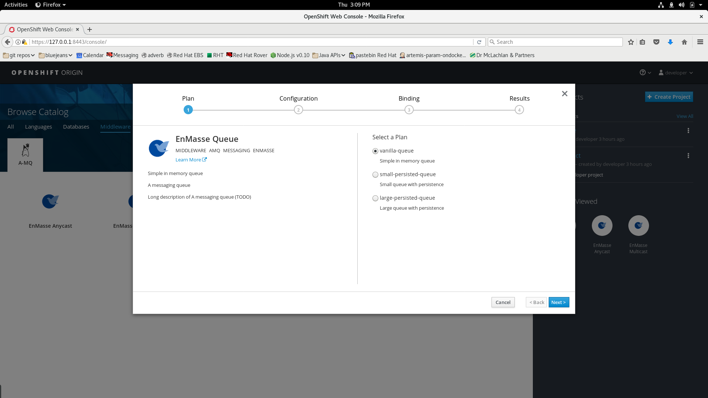
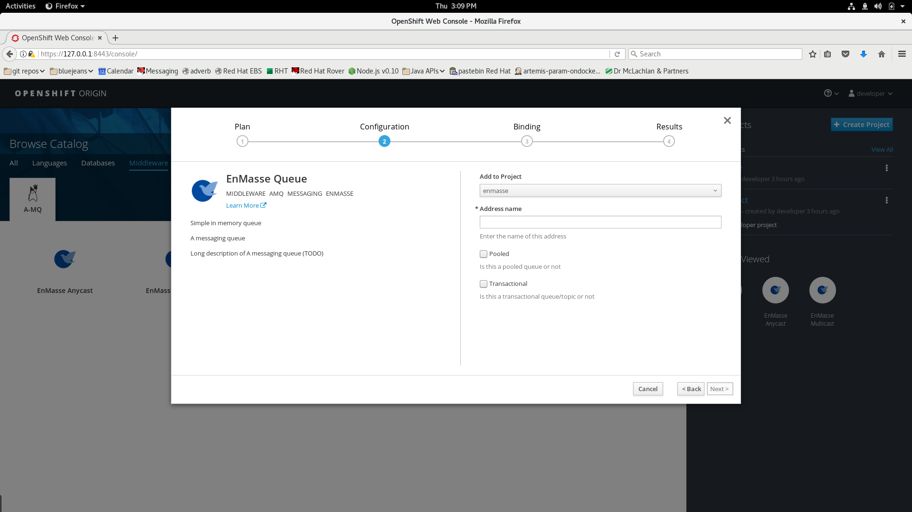

ifdef::env-github[]
:imagesdir: https://github.com/EnMasseProject/enmasse/raw/master/documentation/userdoc/
endif::[]
= Desired User Documentation

This is an initial attempt to begin listing the different things that
should be documented for the enmasse system. Additions, corrections
and other changes are all very welcome!

== Installation Guide

Similar to the link:../getting-started/README.adoc[getting started
guide], a description of how to install enmasse for different
scenarios.

== Service Catalog Service descriptions

When creating addresses of different types through the service broker,
there is the facility to provide descriptions of the services and
links to further information. Below are two screenshots, encountered
when creating a queue:

For each service type - queue, topic, direct-anycast and
direct-multicast - we should provide:

* a one sentence description of that pattern of communication

* a paragraph describing the pattern in more detail

* a link to a separate addressing concepts guide

Each service will also have an associated plan, which again needs some
description, and ideally also a link to further information.

(There could perhaps also be a link to the full enmasse use guide?)

The same information should be displayed in the enmasse console's own
address creation wizard screens (assuming we keep those).

== How to connect and how to send and consume from a given address

The connection information (i.e. the details of the route through
which the messaging service is exposed) could be displayed in the
dashboard of the enmasse console.

In the address screen of the console you could provide some
information on how to send/receive as well as perhaps how to
connect. This could be generic information and possibly also tailored
for specific popular clients.

Here we would cover AMQP and MQTT.

There could also be links to the feature guide.

== Help interpreting the statistics shown in the console

E.g. explaining what shards are (assuming that ends up being something
we consider relevant to the user), explaining the different delivery
outcomes on a link or explaining the encrypted/unencrypted icon in the
connection view.

== Help using features of the console

E.g. how to filter the set of addresses or connection shown.

== Feature guide

I.e. a description of all the features supported, including which
address types they are supported for and help on how to use those
features from different commonly used clients.

e.g.

* durable subscriptions
* selectors
* message ttl
* acknowledgement/rejection and delivery guarantees

== Troubleshooting

Perhaps try and build up a list of commonly encountered issues,
describing symptoms, explaining the issue and suggesting ways to
resolve it. (This might be out of scope in the first instance?).
