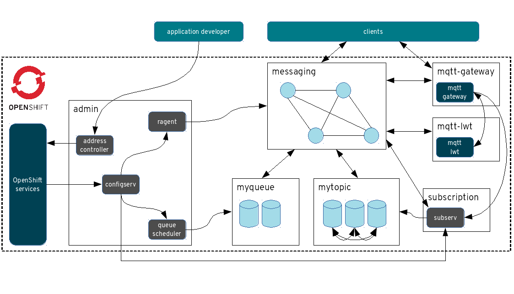

[[enmasse-architecture]]
= EnMasse architecture

An EnMasse cluster contains an admin component that handles address
configuration deployment, router network configuration, discovery
services over AMQP, and deployment of broker templates based on the
address config and flavor config. The router network is the main entry
for all clients, and routes traffic to brokers and the subscription
service. The subscription service is used by clients to create durable
subscriptions, either link routed or message routerd, as well as by the
MQTT gateway. The MQTT gateway handles MQTT clients, and acts as a
bridge for MQTT<->AMQP in EnMasse.

