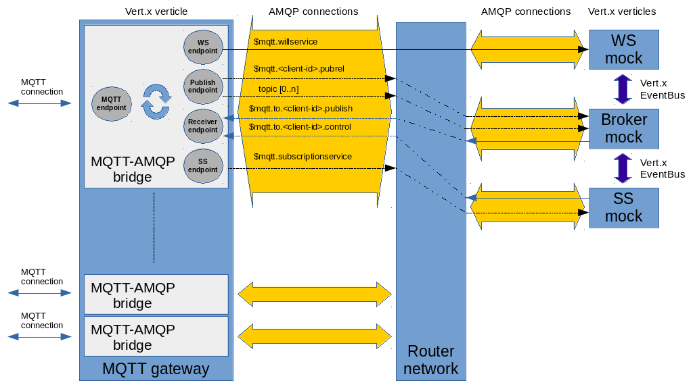

# MQTT over AMQP

Design and specification for bringing MQTT features over AMQP protocol.

> The main purpose of this specification isn't the simple bridge from MQTT to AMQP but adding native MQTT features on top of AMQP. It means, for example, having "will testament", "retained" messages and client sessions on AMQP so that a pure AMQP client can use them.

## Preface

The following documentation has no assumptions on the implementation side. It means that every “service” can implement its API in different ways (i.e. using AMQP brokers, database, log file, …). By the way for each service a possible implementation is described using AMQP brokers where "store-and-forward" is needed.

## Content

* [Components](docs/components.md)
* Services
  * [Will Service](docs/services_will_service.md)
  * [Subscription Services](docs/services_subscription_service.md)
* Operations
  * [Connection](docs/operations_connection.md)
  * [Disconnection](docs/operations_disconnection.md)
  * [Subscription/Unsubscription](docs/operations_subscription_unsubscription.md)
  * [Publish](docs/operations_publish.md)
  * [Keep alive](docs/operations_keepalive.md)
* Implementation
  * [Will Service](docs/implementation_will_service.md)
  * [Subscription Service](docs/implementation_subscription_service.md)

## EnMasse implementation

The implementation for EnMasse can be found [here](https://github.com/EnMasseProject/mqtt-gateway) and following its overall big picture :

