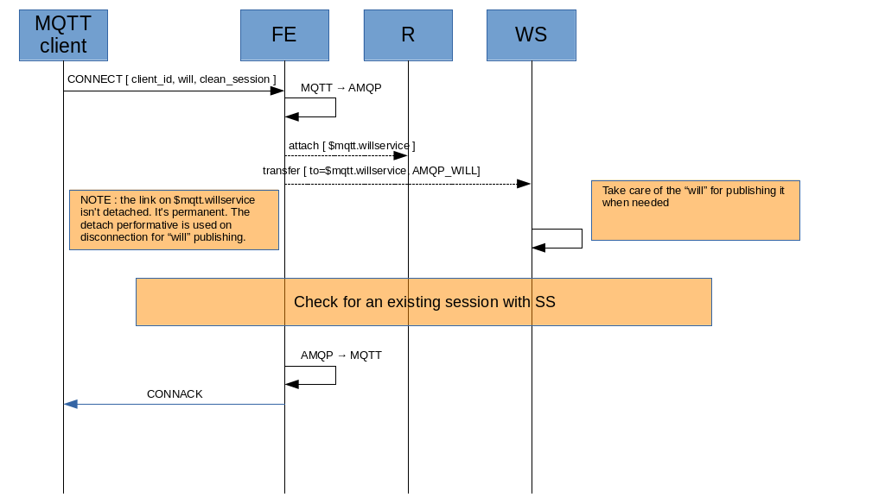
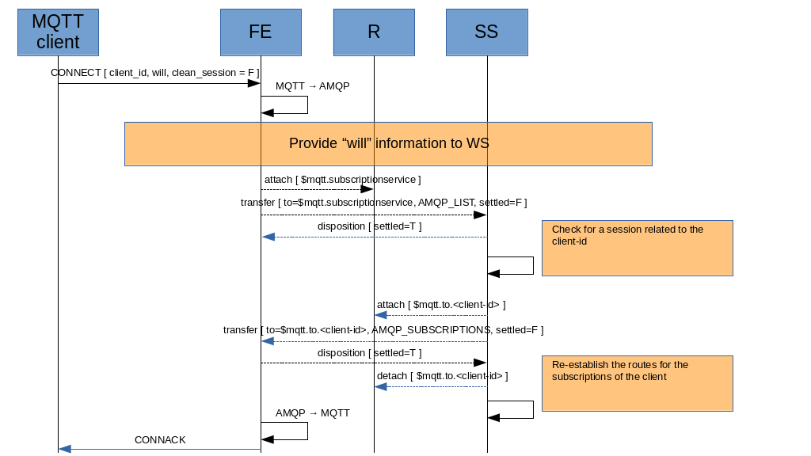
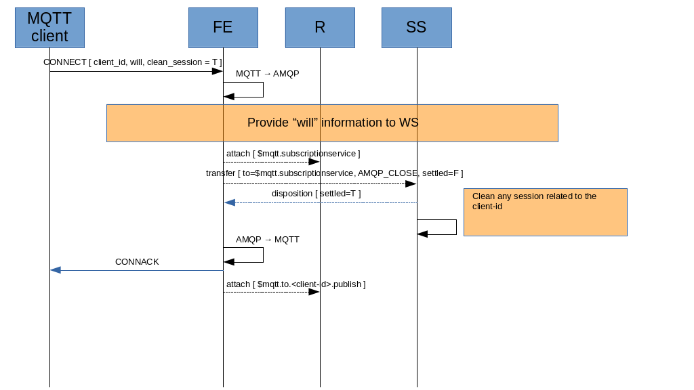

# Connection

## FE attached links

The FE needs to attach a link with sender role to the Will Service control address. It should have QoS as AT_LEAST_ONCE so with :

* rcv-settle-mode : first (0)
* snd-settle-mode : unsettled (0)

The FE needs to attach a link with sender role to the Subscription Service control address. It should have QoS as AT_LEAST_ONCE so with :

* rcv-settle-mode : first (0)
* snd-settle-mode : unsettled (0)

The FE needs to attach a link with receiver role to the unique client address $mqtt.to.[client-id]. It should have QoS as AT_LEAST_ONCE so with :

* rcv-settle-mode : first (0)
* snd-settle-mode : unsettled (0)

or using "mixed" (2) for the "snd-settle-mode", in order to allow the sender on the other side to send messages both "settle" and "unsettled" on the same link.

## "Will" information to Will Service

The MQTT client sends a _CONNECT_ message to the FE which extracts "will" information for building the following AMQP message to send to the Will Service.

**AMQP_WILL** : sent to the WS in order to provide “will” information.

| DATA | TYPE | VALUE | FROM |
| ---- | ---- | ----- | ---- |
| subject | system property | "will" | - |
| x-retain | message annotation | will retain flag | MQTT CONNECT |
| x-qos | message annotation | will QoS level | MQTT CONNECT |
| durable | header | will QoS level > 0 | MQTT CONNECT |
| to | system property | will topic | MQTT CONNECT |
| payload | Data section | will message | MQTT CONNECT |

> the MQTT QoS level is copied to the x-qos annotation. At same time the "durable" header field is set as FALSE if QoS level is 0, TRUE if QoS level is 1 or 2. When the x-qos annotations isn't present (i.e. AMQP_WILL published from a native AMQP client which doesn't add it), fallback to use only "durable" and if it's TRUE consider QoS level 1 as default.

The _AMQP_WILL_ is sent as "unsettled", in order to know that the Will Service has received it (with related disposition).
The relation between the _AMQP_WILL_ message and the related client, at AMQP level, is inferred by the link name attached to the WS control address.

The FE attaches a permanent link to the $mqtt.willservice address; the WS maps the link-name with the “will” information provided in order to have a 1-1 relationship between them. See “Disconnection”, in order to know how publishing “will” information could happen on client disconnection.

> the _AMQP_WILL_ message can be sent by the FE even during client life (not only on connection). It means to overwrite the last “will” information (something that doesn’t exist in the MQTT spec).

## "Session" request to Subscription Service

From the same received MQTT _CONNECT_ message, the FE extracts information related to session handling for building the following AMQP messages to send to the Subscription Service.
The AMQP message sent depends on the "clean session" flag in the received _CONNECT_ message :

* clean session is TRUE : the _AMQP_CLOSE_ message is used in order to clean any previous session.
* clean session is FALSE : the _AMQP_LIST_ message is used in order to recover the last session with related subscriptions.

### Not clean-session

If the "clean session" from _CONNECT_ packet is FALSE.

**AMQP_LIST** : sent to the SS in order to to recover the last session with related subscriptions.

| DATA | TYPE | VALUE | FROM |
| ---- | ---- | ----- | ---- |
| subject | system property | "list" | - |
| correlation-id | system property | $mqtt.to.[client-id] | - |
| reply-to | system property | $mqtt.to.[client-id] | - |

The _AMQP_LIST_ is sent as "unsettled", in order to know that the Subscription Service has received it (with related disposition).
The relation between the _AMQP_LIST_ message and the related client, at AMQP level, is inferred by the link name attached to the SS control address.

> the [client-id] is the "client identifier" value from the MQTT CONNECT message.

After sending the _AMQP_LIST_, the FE receives the following message as reply.

**AMQP_SUBSCRIPTIONS** : sent by the SS to report to FE the last session with related subscriptions.

| DATA | TYPE | VALUE | FROM |
| ---- | ---- | ----- | ---- |
| subject | system property | "subscriptions" | - |
| payload | AMQP value | Map with topics (as key) and qos (as value) | - |

> the map with topics and corresponding qos is related to the subscriptions that were in place in the previous session, now recovered.

The _AMQP_SUBSCRIPTIONS_ is sent as "unsettled", in order to know that the FE has received it (with related disposition).

If a session is present and there are subscriptions for the client-id, the SS re-establishes the routes from each topic to the $mqtt.to.[client-id] automatically (see “Subscription/Unsubscription”). No need for the SS to send subscriptions list to the FE in order to re-subscribe.

> the SS should send the _AMQP_SUBSCRIPTIONS_ message to FE before re-establishing routes for the topics because it should be first message received by FE (in order to build the _CONNACK_) if there are messages stored when the client was offline that will be puslished now on re-connect.

### Clean-session

If the "clean session" from _CONNECT_ packet is TRUE.

**AMQP_CLOSE** : sent to the SS in order to clean any previous session.

| DATA | TYPE | VALUE | FROM |
| ---- | ---- | ----- | ---- |
| subject | system property | "close" | - |
| correlation-id | system property | $mqtt.to.[client-id] | - |

## Reply to MQTT client

Based on the replies from Will Service and mostly Subscription Service, the FE builds the _CONNACK_ message and sends it to the MQTT client.

**CONNACK**

| DATA | VALUE | FROM |
| ---- | ----- | ---- |
| Session present | if sesson is already present | Session present  |
| Connect return code | It can depends on some checks on FE side or other on AMQP side | - |

> the session present could be (_AMQP_SUBSCRIPTIONS_ body != empty) if _AMQP_LIST_ is used otherwise (_AMQP_CLOSE_ used), it's FALSE.
