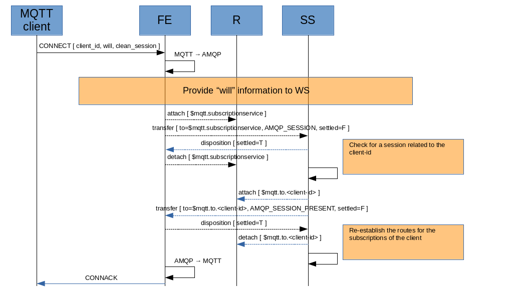

# Connection

The MQTT client sends a _CONNECT_ message to the FE which maps the message to the following AMQP messages.

**AMQP_WILL** : sent to the WS in order to provide “will” information.

| DATA | TYPE | VALUE | FROM |
| ---- | ---- | ----- | ---- |
| subject | system property | "will" | - |
| x-retain | message annotation | will retain flag | MQTT CONNECT |
| x-desired-snd-settle-mode | message annotation | will QoS level | MQTT CONNECT |
| x-desired-rcv-settle-mode | message annotation | will QoS level | MQTT CONNECT |
| to | system property | will topic | MQTT CONNECT |
| payload | Data section | will message | MQTT CONNECT |

> the MQTT QoS level is mapped to the AMQP couple snd-settle-mode and rcv-settle-mode (see "“Publishing”").

The relation between the _AMQP_WILL_ message and the related client, at AMQP level, is inferred by the link name attached to the WS control address.

**AMQP_SESSION** : sent to the SS in order to provide “clean-session” information and querying for a previous session.

| DATA | TYPE | VALUE | FROM |
| ---- | ---- | ----- | ---- |
| subject | system property | "session" | - |
| x-clean-session | message annotation | clean session flag | MQTT CONNECT |
| reply-to | system property | $mqtt.to.[client-id] | - |

The relation between the _AMQP_SESSION_ message and the related client, at AMQP level, is inferred by the link name attached to the SS control address.

> the [client-id] is the "client identifier" value from the MQTT CONNECT message.

After sending the _AMQP_SESSION_, the FE receives the following message as reply.

**AMQP_SESSION_PRESENT** : sent by the SS to report to FE if a session is already.

| DATA | TYPE | VALUE | FROM |
| ---- | ---- | ----- | ---- |
| subject | system property | "session-present" | - |
| x-session-present | message annotation | if client session did already exist and routes were recovered | - |

If a session is present and there are subscriptions for the client-id, the SS re-establishes the routes from each topic to the $mqtt.to.[client-id] automatically (see “Subscription/Unsubscription”). No need for the SS to send subscriptions list to the FE in order to re-subscribe.

> the SS should send the _AMQP_SESSION_PRESENT_ message to FE before re-establishing routes for the topics because it should be first message received by FE (in order to build the CONNACK) if there are messages stored when the client was offline that will be puslished now on re-connect.

Regarding the WS, the FE attaches a permanent link to the $mqtt.willservice address; the WS maps the link-name with the “will” information provided in order to have a 1-1 relationship between them. See “Disconnection”, in order to know how publishing “will” information could happen on client disconnection.

> the _AMQP_WILL_ message can be sent by the FE even during client life (not only on connection). It means to overwrite the last “will” information (something that doesn’t exist in the MQTT spec).

The FE builds the _CONNACK_ message and sends it to the MQTT client.

**CONNACK**

| DATA | VALUE | FROM |
| ---- | ----- | ---- |
| Session present | if sesson is already present | AMQP_SESSION_PRESENT  |
| Connect return code | It can depends on some checks on FE side or other on AMQP side | - |
